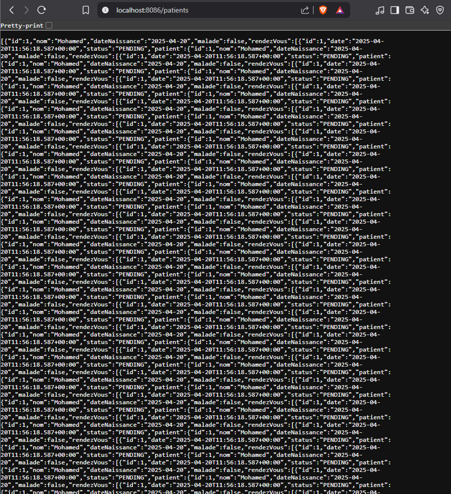
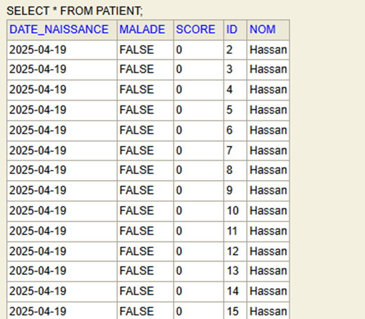
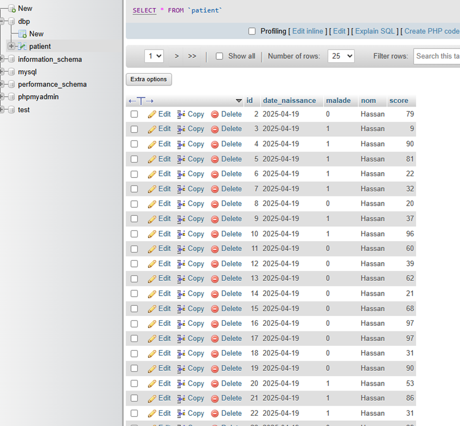
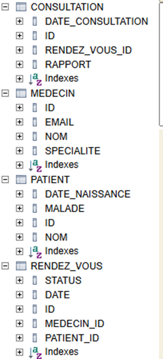
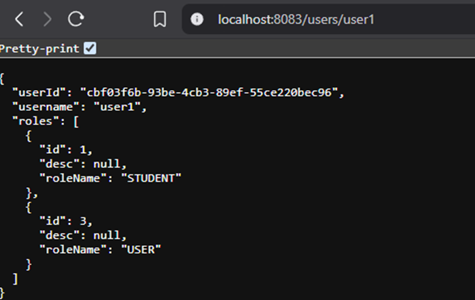
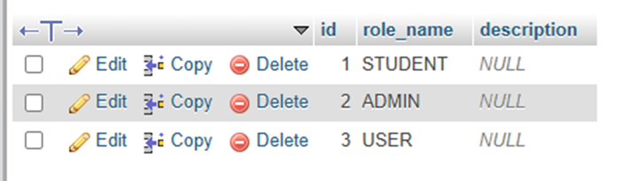
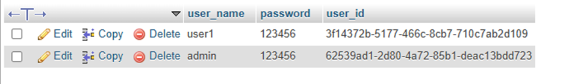
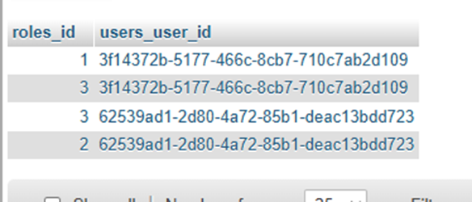

# Spring Data, JPA, Hibernate

## Expérimentations 

Ce projet  explore la persistance des données, la gestion des entités, les associations, ainsi que des optimisations de performance comme la pagination et les stratégies de chargement.

## Technologies utilisées

- Spring Boot
- Spring Data JPA
- Hibernate
- Lombok
- Base de données H2 en mémoire
- MySQL pour tests avancés

## Modélisation des entités

Les entités comme `Patient` sont annotées avec `@Entity`.  
Lombok (`@Data`) est utilisé pour générer automatiquement les getters, setters, et constructeurs.  
Le plugin Lombok doit être installé dans l’environnement de développement pour fonctionner correctement.

Pour éviter les erreurs de type `StackOverflowError` sur les relations bidirectionnelles (par exemple avec `@ManyToMany`), il est recommandé de désactiver la génération automatique de `toString()` dans certaines entités.

## Configuration de la base de données

La configuration se fait dans le fichier `application.properties`.

Exemple pour la base H2 en mémoire :

spring.datasource.url=jdbc\:h2\:mem\:patient-db
spring.h2.console.enabled=true

- Hibernate crée automatiquement les tables à partir des entités.
- L’annotation `@Column` permet de personnaliser la taille ou le type des colonnes.
- Pour les champs de type date, il est possible de spécifier le format souhaité afin de ne stocker que le jour, le mois et l’année.

## Requêtes et gestion des données

Les opérations CRUD sont gérées automatiquement par les interfaces Repository.

- `save()` :
  - Effectue un `INSERT` si l'identifiant est nul.
  - Effectue un `UPDATE` sinon.
  - Retourne toujours l’objet sauvegardé.

- `findById()` :
  - Retourne un objet `Optional`.
  - Nécessite une gestion explicite pour accéder à l’objet.

- `deleteById()` permet de supprimer un enregistrement.

## Problèmes de performance

L’utilisation de `findAll()` sur un grand volume de données (exemple : un million de lignes) est inefficace car elle charge tout en mémoire.

Solution : utiliser la pagination avec l’API `PageRequest` de Spring Data.

```java
Page<Patient> patients = patientRepository.findAll(PageRequest.of(0, 5));
````

Les requêtes peuvent aussi être paginées avec des filtres, comme rechercher uniquement les patients malades.
Ces requêtes utilisent des méthodes personnalisées annotées avec `@Query` et `@Param`.

## Mapping des associations

Les types d’associations suivants sont expérimentés :

* `@OneToMany`
* `@ManyToOne`
* `@OneToOne`
* `@ManyToMany`

Deux stratégies de chargement sont utilisées :

* `FetchType.LAZY` (chargement différé) : ne charge les entités liées que lorsqu’elles sont explicitement appelées.
* `FetchType.EAGER` (chargement immédiat) : charge toutes les entités liées en une seule fois.

L’utilisation de `EAGER` est déconseillée avec `findAll()` si les données liées sont volumineuses.

Dans les relations bidirectionnelles, une attention particulière est portée à la sérialisation JSON (boucles infinies) et à la gestion de la mémoire.

## Structure de l'application

Le projet suit une structure en couches :

* **Contrôleur** : gère les routes et les interactions HTTP.
* **Service** : contient la logique métier. Annoté avec `@Transactional` pour la gestion automatique des transactions.
* **Repository** : interface vers la base de données.

## Autres annotations utiles

* `@Bean` : permet de déclarer des objets injectables au démarrage.
* `@Autowired` : injection automatique des dépendances.
* `@Enumerated(EnumType.STRING)` : permet d'afficher des valeurs d’enum en texte lisible.
* `@Query` : permet d’écrire des requêtes personnalisées JPQL ou SQL natif.
* `@Param` : permet de passer des paramètres nommés dans les requêtes.

## Problèmes rencontrés

* Erreur `StackOverflowError` avec `@Data` dans des entités fortement liées.
* Boucles infinies dans les relations bidirectionnelles mal configurées.
* Solution : utiliser la stratégie LAZY



## Conclusion

Cette expérimentation met en évidence les fonctionnalités et les bonnes pratiques avec Spring Data JPA : configuration de la base, gestion des entités et relations, optimisation des performances avec la pagination, et compréhension des mécanismes internes de persistance. Elle permet également de mieux anticiper les erreurs fréquentes lors de la conception de modèles de données complexes.


## Screens





### Exemple d'endpoint



### Records de base de données



