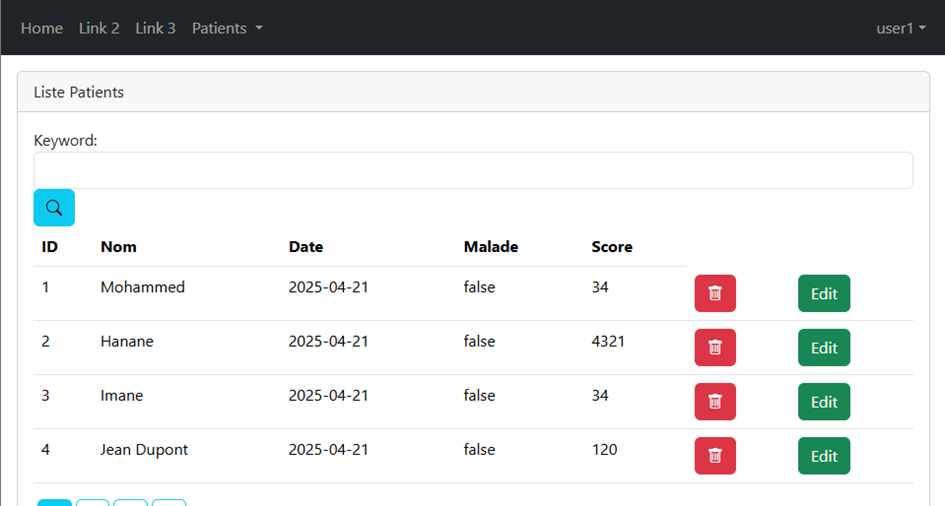
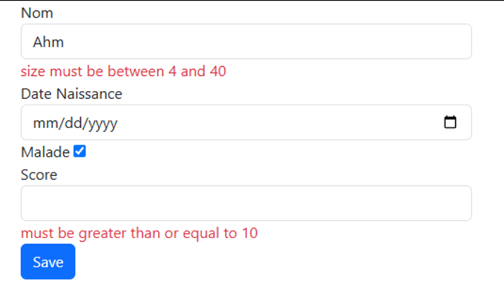

# 📋 Gestion des Patients (Spring Boot MVC Thymeleaf)

## Technologies de Base

* **Frameworks** : Spring Boot, Spring MVC, Thymeleaf, Spring Data, JPA
* **Développement** : Spring Boot DevTools activé pour le rechargement automatique

---

## Dépendances Principales

* `spring-boot-starter-web`
* `spring-boot-starter-thymeleaf`
* `spring-boot-devtools`
* `spring-boot-starter-validation`
* `spring-boot-starter-security`
* **Bootstrap** (via CDN ou dépendance Maven pour le style et les icônes)

---

## Fonctionnalités Clés

### 1. Déclaration et Initialisation des Objets

* Trois méthodes utilisées pour déclarer et initialiser les objets.

### 2. Affichage des Données

* Accès via `/index`
* Liste des patients passée à la vue via un contrôleur.
* Affichage dynamique avec **Thymeleaf**.
* Style avec **Bootstrap**.

### 3. Pagination

* Gestion dynamique via les paramètres `page` et `size` dans l'URL :

  ```
  http://localhost:8084/index?page=0&size=3
  ```
* Valeurs par défaut : `page = 0`, `size` personnalisable
* Utilisation de Bootstrap pour la navigation (nav-pills, status, etc.)

### 4. Recherche

* Recherche de patients par nom avec `@RequestParam("keyword")`
* Utilisation de `findByNom(...)` au lieu de `findAll()`
* Fonctionne avec la pagination
* Conservation du mot-clé après une suppression
* Icône de recherche intégrée avec Bootstrap

### 5. Suppression

* Méthode `delete()` pour supprimer un patient
* Retour à la même page avec les mêmes paramètres (page et mot-clé)
* Icône de poubelle pour la suppression (via Bootstrap)

### 6. Utilisation de Templates (Thymeleaf)

* Structuration des vues avec des templates
* Utilisation de `th:insert` et de namespaces
* Dépendance spécifique ajoutée pour cette fonctionnalité

### 7. Formatage des Dates

* Correction via l’annotation `@DateTimeFormat` dans les entités

### 8. Validation des Champs

* Ajout de dépendance Spring Boot Validation
* Utilisation de `@Valid` pour valider les champs d’un patient
* Blocage de la persistance en cas d'erreurs, affichage des messages d’erreurs dans la vue

### 9. Édition

* Fonctionnalité d’édition des données d’un patient incluse

---

## Sécurité - Spring Security

* Accès à `/index` restreint : login requis
* Authentification en mémoire (`inMemoryAuthentication`)
* Exemple d'utilisateur :

  ```java
  username: User1
  password: 12345
  ```
* Création d’un `PasswordEncoder` pour gérer l’encodage
* Affichage du nom de l’utilisateur connecté
* Contrôle d’accès par rôle :

  * Les boutons d’édition sont visibles uniquement pour les utilisateurs avec le rôle `admin`
* Page personnalisée pour accès refusé
* Formulaire de connexion personnalisé avec option "remember me"
* Possibilité de stocker les utilisateurs de manière persistante


---
## Screenshots :




---
## Démarrage

1. Cloner le projet
2. Vérifier les dépendances dans `pom.xml`
3. Lancer l'application (`mvn spring-boot:run`)
4. Accéder à [http://localhost:8084/index](http://localhost:8084/index)

---
